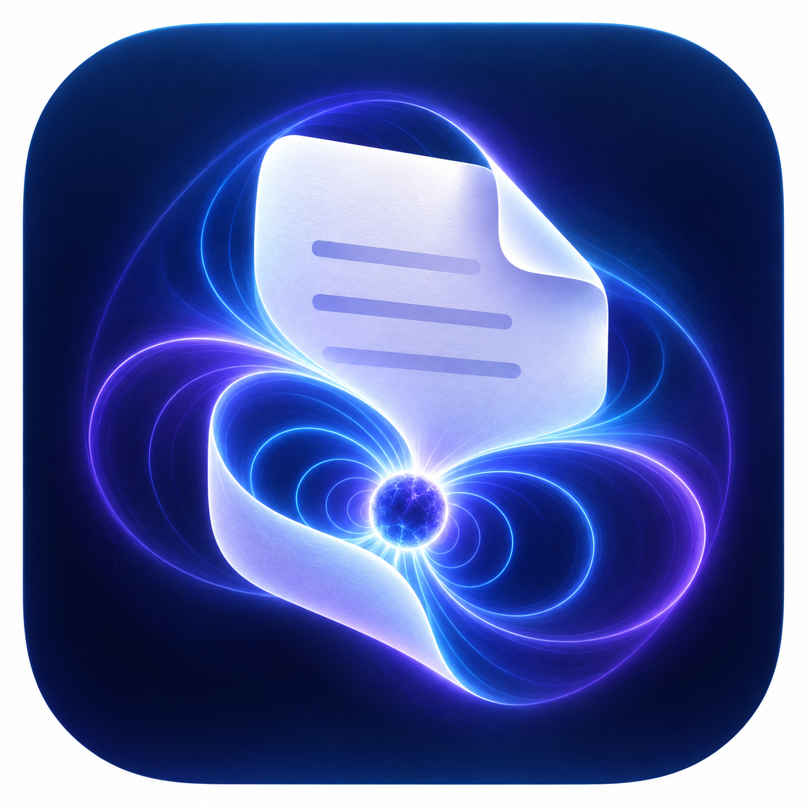
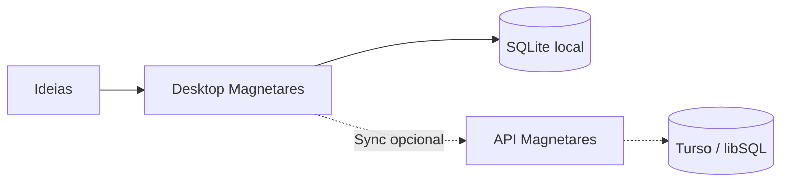

# Magnetares Notes

<p align="center">
  
</p>

<p align="center">
  <strong>Onde ideias ganham órbita.</strong><br />
  Notas locais, estruturadas e prontas para acompanhar você em qualquer dispositivo.
</p>

<p align="center">
  <a href="https://github.com/vitorkrewer/magnetares-notes/actions/workflows/ci.yml"></a>
  <a href="https://github.com/vitorkrewer/magnetares-notes/actions/workflows/release.yml"></a>
  <a href="https://vitorkrewer.github.io/magnetares-notes/"></a>
  <a href="docs/README.md"></a>
  
  
</p>

<p align="center">
  <a href="https://vitorkrewer.github.io/magnetares-notes/">Site</a> ·
  <a href="docs/README.md">Documentação</a> ·
  <a href="CHANGELOG.md">Changelog</a> ·
  <a href="https://github.com/vitorkrewer/magnetares-notes/releases">Downloads</a>
</p>

---

## Visão geral

Magnetares Notes é um aplicativo desktop **local-first** para Windows, Linux e macOS. Ele abre, pesquisa e salva suas notas em SQLite mesmo offline. Quando você quiser continuidade entre computadores, pode conectar seu Turso e sincronizar as alterações pendentes.



## Recursos

| Área | Disponível hoje |
| --- | --- |
| **Editor** | Títulos, negrito, itálico, destaque, listas, citações, checklists, tabelas e cálculos inline. |
| **Organização** | Pastas/subpastas expansíveis, arrastar e soltar, notas fixadas, etiquetas e Pastas Inteligentes. |
| **Dados locais** | SQLite com WAL, migrações incrementais, lixeira, restauração e escolha do caminho do banco. |
| **Portabilidade** | Importação Markdown/TXT, exportação Markdown/HTML/TXT e impressão limpa. |
| **Experiência** | Tema claro/escuro, barra de título desktop e layout responsivo de três painéis. |
| **Sync beta** | Outbox local, cursor remoto, revisão e preservação de conflitos para notas e lixeira. |

> Confira a [matriz de funcionalidades](docs/feature-status.md) para status detalhado de recursos implementados, beta e planejados.

## Começar a usar

Baixe a versão adequada na página de [Releases](https://github.com/vitorkrewer/magnetares-notes/releases):

| Plataforma | Artefato esperado |
| --- | --- |
| Windows | `Magnetares-Notes-Windows-x64.exe` |
| Linux | `Magnetares-Notes-Linux-x64.tar.gz` |
| macOS | `Magnetares-Notes-macOS-universal.zip` |

Na primeira abertura, o Magnetares cria seu banco local automaticamente. Não há necessidade de conta, internet ou configuração para começar a escrever.

Para sincronizar outro computador:

1. Abra **Preferências > Nuvem & Turso**.
2. Informe a URL e o token do seu banco Turso.
3. Clique em **Conectar Turso**.
4. Em outro computador, informe os mesmos dados e sincronize para popular o SQLite local.

O token é guardado no cofre de credenciais do sistema operacional e não é embutido no aplicativo.

Leia o [Guia inicial](docs/getting-started.md) e o [Guia do usuário](docs/user-guide.md) para instruções completas.

## Desenvolvimento local

### Requisitos

- Go `1.25+`
- Node.js `22+` e npm
- Wails `v2.16.0`
- WebView2 no Windows

```powershell
git clone https://github.com/vitorkrewer/magnetares-notes.git
Set-Location magnetares-notes/apps/desktop/frontend
npm ci

go install github.com/wailsapp/wails/v2/cmd/wails@v2.16.0

Set-Location ..
wails dev -skipbindings
```

Comandos úteis:

```powershell
# Frontend
Set-Location apps/desktop/frontend
npm run dev
npm run build
npm run lint

# Desktop
Set-Location apps/desktop
go test .
wails dev -skipbindings
wails build -skipbindings -clean -trimpath

# API
Set-Location ../api
go test ./...
go run .
```

## Arquitetura

```text
apps/
  desktop/               Wails, bridge Go, SQLite local e React
  api/                   API Go e cliente Turso/libSQL
db/migrations/           Esquema remoto incremental
packages/contracts/      OpenAPI
site/                    Landing page estática para GitHub Pages
docs/                    Documentação técnica e operacional
.github/workflows/       CI, release multiplataforma e Pages
```

O frontend acessa recursos locais por uma bridge Wails tipada. O banco Turso é usado apenas para sincronização opcional; notas locais continuam disponíveis sem rede.

## Segurança e sync

- Não versione `.env`, tokens, bancos `.db` ou arquivos de usuário.
- O token Turso nunca deve aparecer no código, assets, release, logs ou screenshots.
- O modo de sync atual é beta/self-managed; antes de operar como serviço público, adicione autenticação de usuário, HTTPS, CORS restrito e API hospedada.
- Pastas, tags e Pastas Inteligentes continuam locais no primeiro corte de sincronização.

Leia [Segurança](docs/security.md) e [API e sincronização](docs/api-and-sync.md) antes de ativar a nuvem.

## Releases e site

- Tags `vMAJOR.MINOR.PATCH` disparam builds para Windows, Linux e macOS.
- `site/` é publicado no GitHub Pages quando `main` recebe alterações nessa pasta.
- Atualize [CHANGELOG.md](CHANGELOG.md) e os links de download em `site/script.js` antes de publicar uma versão.

O checklist completo está em [Release e deploy](docs/release-and-deployment.md).

## Documentação

| Guia | Conteúdo |
| --- | --- |
| [Portal](docs/README.md) | Índice de toda a documentação. |
| [Arquitetura](docs/architecture.md) | Componentes, decisões local-first e Wails. |
| [Dados locais](docs/local-data.md) | SQLite, migrações, backup e restauração. |
| [API e sync](docs/api-and-sync.md) | Cursor, revisões, conflitos e limites atuais. |
| [Desenvolvimento](docs/development.md) | Setup, comandos e diagnóstico. |
| [Testes](docs/testing.md) | Cobertura atual e checklist de regressão. |
| [Feature status](docs/feature-status.md) | Recursos implementados, beta e roadmap. |

---

<p align="center">
  Criado por <a href="https://www.linkedin.com/in/vitorkrewer/">Vitor Krewer</a> ·
  <a href="https://github.com/vitorkrewer">GitHub</a> ·
  <a href="https://github.com/vitorkrewer/magnetares-notes">Repositório</a>
</p>