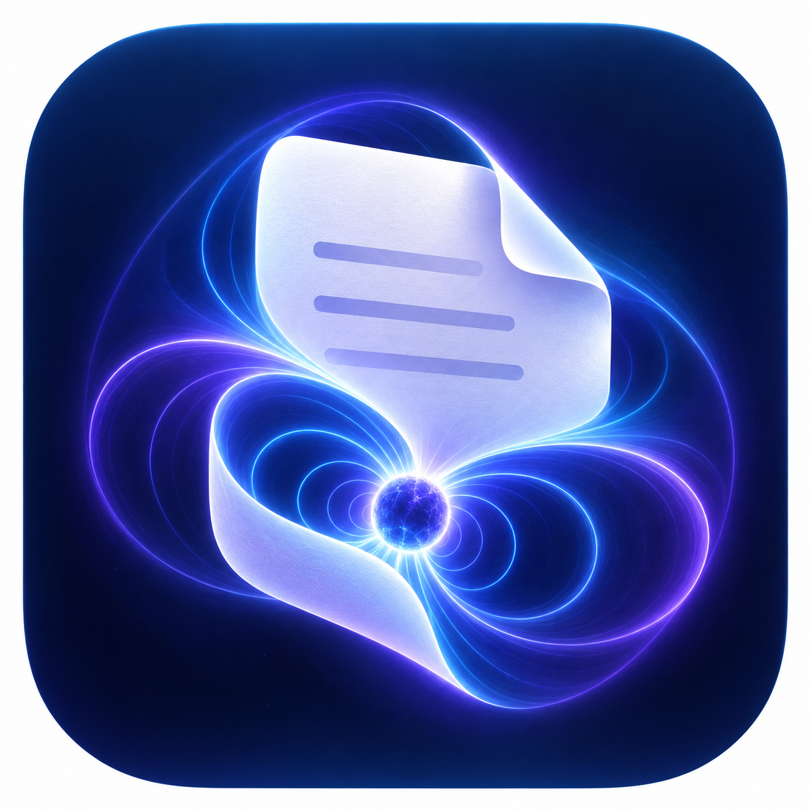
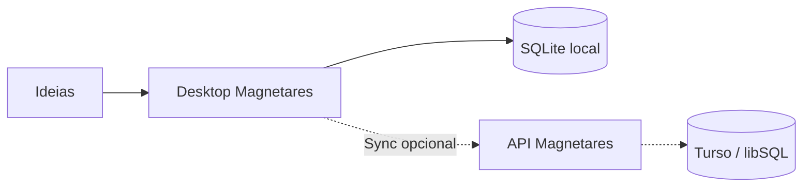

# Magnetares Notes

<p align="center">
  
</p>

<p align="center">
  <strong>Onde ideias ganham órbita.</strong><br />
  Notas locais, estruturadas e prontas para acompanhar você em qualquer dispositivo.
</p>

<p align="center">
  <a href="https://github.com/vitorkrewer/magnetares-notes/actions/workflows/ci.yml"></a>
  <a href="https://github.com/vitorkrewer/magnetares-notes/actions/workflows/release.yml"></a>
  <a href="https://vitorkrewer.github.io/magnetares-notes/"></a>
  <a href="docs/README.md"></a>
  
  
</p>

<p align="center">
  <a href="https://vitorkrewer.github.io/magnetares-notes/">Site</a> ·
  <a href="docs/README.md">Documentação</a> ·
  <a href="CHANGELOG.md">Changelog</a> ·
  <a href="https://github.com/vitorkrewer/magnetares-notes/releases">Downloads</a>
</p>

---

## Visão geral

Magnetares Notes é um aplicativo desktop **local-first** para Windows, Linux e macOS. Ele abre, pesquisa e salva suas notas em SQLite mesmo offline. Quando você quiser continuidade entre computadores, pode conectar sua nuvem e sincronizar as alterações pendentes.


```mermaid
flowchart LR
  I[Ideias] --> D[Desktop Magnetares]
  D --> L[(SQLite local)]
  D -. Sync opcional .-> A[API Magnetares]
  A -.-> T[(Turso / libSQL)]
```

## Recursos

| Área | Disponível hoje |
| --- | --- |
| **Editor** | Títulos, cores customizáveis, alinhamento, espaçamento entre linhas, negrito, itálico, destaque, listas, citações, checklists, tabelas, cálculos inline, hyperlinks e blocos de código. |
| **Code Snippets** | Notas de código independentes com motor Monaco Editor (o mesmo do VS Code). Syntax highlighting avançado, dropdown com diversas linguagens, Color Badges elegantes na interface, e botão de cópia com 1 clique. |
| **Stickers** | Mural full-width de notas autoadesivas (post-its) organizado por quadros dedicados, 8 cores pastel (temas claro/escuro), fixação no topo, busca instantânea e reordenação por Drag & Drop (no mural e entre quadros na barra lateral). |
| **Organização** | Pastas/subpastas com cores HSL e 8 ícones personalizáveis, CRUD de etiquetas com 6 ícones, edição de pastas legadas, notas fixadas e Pastas Inteligentes. |
| **Dados locais & Compliance** | SQLite com WAL, migrações automáticas, lixeira, auditoria de integridade (`EnsureDataCompliance`) e autorreparo em Preferências. |
| **Portabilidade** | Importação Markdown/TXT, exportação Markdown/HTML/TXT com diálogo nativo para escolher o destino e impressão limpa. |
| **Experiência** | Tema claro/escuro, barra de título desktop, layout responsivo de três painéis para notas e full-width para stickers, árvore de pastas alinhada, botão voltar ao topo e tratamento avançado de tags longas. |
| **Sync Nuvem** | Lógica segura de Tombstones (evitando retorno de notas deletadas), Outbox local, transações remotas, snapshots por cursor, sync automático com indicador de nuvem animado, resolução local/remota/merge e sync de pastas e etiquetas (nomes e ícones) com Last-Write-Wins. |

> Confira a [matriz de funcionalidades](docs/feature-status.md) para status detalhado de recursos implementados, beta e planejados.

### Stickers (Notas Autoadesivas)

A partir da versão **1.4.0**, o Magnetares Notes traz um mural visual completo de notas autoadesivas (*post-its*):
- **Quadros dedicados (Boards):** crie e organize notas em múltiplos quadros temáticos (como "Ideias", "Lembretes", "Projetos"), com o quadro padrão "Geral" sempre protegido.
- **Mural em tela cheia (Full-Width):** visualização em grade fluida e responsiva que aproveita toda a largura da janela.
- **Paleta de 8 cores pastel:** amarelo, laranja, rosa, roxo, azul, turquesa, verde e cinza neutro, calibradas para contraste em temas claro e escuro.
- **Edição inline instantânea:** digite títulos (até 120 caracteres) e textos (até 5.000 caracteres) diretamente nos cartões com salvamento automático contínuo.
- **Fixação no topo (Pin):** destaque lembretes cruciais com pin dourado e ordenação prioritária.
- **Movimentação fluida (Drag & Drop):** reordene notas livremente no mural, mova para o final soltando no espaço livre do canvas ou arraste diretamente sobre outros quadros na barra lateral para transferir instantaneamente.

## Começar a usar

Baixe a versão adequada na página de [Releases](https://github.com/vitorkrewer/magnetares-notes/releases):

| Plataforma | Artefato esperado |
| --- | --- |
| Windows | `Magnetares-Notes-Windows-x64.exe` |
| Linux | `Magnetares-Notes-Linux-x64.AppImage`, `Magnetares-Notes-Linux-x64.deb`, `Magnetares-Notes-Linux-x64.tar.gz` |
| macOS | `Magnetares-Notes-macOS-universal.zip` |

Na primeira abertura, o Magnetares cria seu banco local automaticamente. Não há necessidade de conta, internet ou configuração para começar a escrever.

Para sincronizar outro computador:

1. Abra **Preferências > Sincronização em Nuvem**.
2. Informe a URL do banco de dados e o token de autenticação da nuvem.
3. Clique em **Conectar Nuvem**.
4. Em outro computador, informe os mesmos dados e sincronize para popular o SQLite local.
5. Opcionalmente, escolha a frequência da sincronização automática (5, 15, 30 ou 60 minutos). O ícone de nuvem na barra lateral indica quando a sincronização está ativa e quando será a próxima.

O token é guardado no cofre de credenciais do sistema operacional e não é embutido no aplicativo.

> **Provedores de nuvem:** hoje a sincronização é suportada via **Turso (libSQL)**. Novas opções de nuvem estarão disponíveis em breve.

Leia o [Guia inicial](docs/getting-started.md) e o [Guia do usuário](docs/user-guide.md) para instruções completas.

## Desenvolvimento local

### Requisitos

- Go `1.25+`
- Node.js `22+` e npm
- Wails `v2.16.0`
- WebView2 no Windows

```powershell
git clone https://github.com/vitorkrewer/magnetares-notes.git
Set-Location magnetares-notes/apps/desktop/frontend
npm ci

go install github.com/wailsapp/wails/v2/cmd/wails@v2.16.0

Set-Location ..
wails dev -skipbindings
```

Comandos úteis:

```powershell
# Frontend
Set-Location apps/desktop/frontend
npm run dev
npm run build
npm run lint

# Desktop
Set-Location apps/desktop
go test .
wails dev -skipbindings
wails build -skipbindings -clean -trimpath

# Laboratório de sincronização com cinco computadores
Set-Location ../../tests
go test -v -count=1 -timeout=2m .

# API
Set-Location ../api
go test ./...
go run .
```

## Arquitetura

```text
apps/
  desktop/               Wails, bridge Go, SQLite local e React
  api/                   API Go e cliente Turso/libSQL
db/migrations/           Esquema remoto incremental
packages/contracts/      OpenAPI
site/                    Landing page estática para GitHub Pages
docs/                    Documentação técnica e operacional
.github/workflows/       CI, release multiplataforma e Pages
```

O frontend acessa recursos locais por uma bridge Wails tipada. O banco Turso é usado apenas para sincronização opcional; notas locais continuam disponíveis sem rede.

## Segurança e sync

- Não versione `.env`, tokens, bancos `.db` ou arquivos de usuário.
- O token Turso nunca deve aparecer no código, assets, release, logs ou screenshots.
- O modo de sync atual é beta/self-managed; antes de operar como serviço público, adicione autenticação de usuário, HTTPS, CORS restrito e API hospedada.
- Nomes e ícones do catálogo de etiquetas e as associações de tags das notas são sincronizados; renomear uma etiqueta reenvia as notas vinculadas.

Leia [Segurança](docs/security.md) e [API e sincronização](docs/api-and-sync.md) antes de ativar a nuvem.

## Releases e site

- Tags `vMAJOR.MINOR.PATCH` disparam builds para Windows, Linux e macOS.
- `site/` é publicado no GitHub Pages quando `main` recebe alterações nessa pasta.
- Atualize [CHANGELOG.md](CHANGELOG.md) e os links de download em `site/script.js` antes de publicar uma versão.

O checklist completo está em [Release e deploy](docs/release-and-deployment.md).

## Documentação

| Guia | Conteúdo |
| --- | --- |
| [Portal](docs/README.md) | Índice de toda a documentação. |
| [Arquitetura](docs/architecture.md) | Componentes, decisões local-first e Wails. |
| [Dados locais](docs/local-data.md) | SQLite, migrações, backup e restauração. |
| [API e sync](docs/api-and-sync.md) | Cursor, revisões, conflitos e limites atuais. |
| [Desenvolvimento](docs/development.md) | Setup, comandos e diagnóstico. |
| [Testes](docs/testing.md) | Cobertura atual e checklist de regressão. |
| [Feature status](docs/feature-status.md) | Recursos implementados, beta e roadmap. |

## Licença e Termos de Uso

Este projeto está sob o modelo **Source-Available (Personal & Non-Commercial Use Only)**:

- 💻 **Modelo:** *Source-Available Software License* (Código de Fonte Disponível para Auditoria e Uso Pessoal).
- ✅ **Download e Execução:** Gratuito e liberado para estudo, auditoria pessoal e uso individual diário (não-comercial).
- 🚫 **Restrição Não-Comercial (NC):** Vedado o uso comercial, corporativo, venda ou oferta como serviço pago (SaaS) sem autorização expressa por escrito.
- ⚠️ **Modificações Prévias (Prior Notice):** Qualquer alteração, trabalho derivado ou fork público deve ser previamente informado ao autor via Issue / PR no repositório.

Para ler os termos integrais e disposições legais, consulte o arquivo [LICENSE](LICENSE).

---

<p align="center">
  Criado por <a href="https://www.linkedin.com/in/vitorkrewer/">Vitor Krewer</a> ·
  <a href="https://github.com/vitorkrewer">GitHub</a> ·
  <a href="https://github.com/vitorkrewer/magnetares-notes">Repositório</a>
</p>