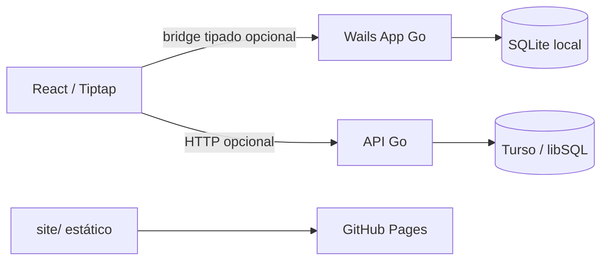
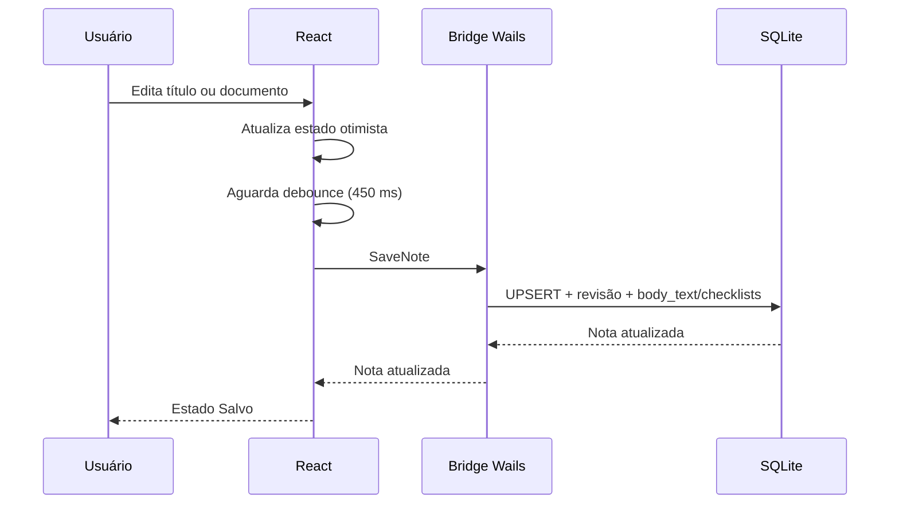

# Arquitetura

## Visão geral

O Magnetares é composto por três superfícies independentes:

| Superfície | Diretório | Responsabilidade |
| --- | --- | --- |
| Desktop | `apps/desktop` | Aplicativo Wails, banco local, bridge de janela e interface React. |
| API | `apps/api` | Endpoint HTTP de sincronização e cliente Turso. |
| Site | `site` | Landing page estática publicada no GitHub Pages. |

## Desktop

### Processo Go/Wails

`apps/desktop/main.go` cria uma janela sem moldura (`Frameless`) e vincula uma instância de `App` ao frontend. A bridge expõe métodos tipados para notas, pastas, tags, Pastas Inteligentes, caminho de banco e controles de janela.

Exemplos de métodos expostos:

- `ListNotes`, `SaveNote`, `DeleteNote`, `RestoreNote`.
- `ListNavigation`, `SaveFolder`, `MoveNote`, `SetNotePinned`, `SetNoteTags`.
- `QueryNotes`, `SaveSmartFolder`, `DeleteSmartFolder`.
- `GetDatabasePath`, `SetCustomDatabasePath`.
- `MinimizeWindow`, `ToggleMaximizeWindow`, `CloseWindow`.

### Frontend

O frontend fica em `apps/desktop/frontend` e é construído por Vite/React.

- `App.tsx`: estado, autosave, navegação, diálogos e integração bridge/API.
- `StructuredEditor.tsx`: Tiptap e toolbar de formatação.
- `CalculationNode.tsx`: nó inline de cálculo matemático.
- `SettingsDialog.tsx`: tema, dados locais e nuvem.
- `types.ts`: contrato TypeScript da bridge Wails.

O código acessa Wails de forma opcional (`window.go?.main?.App`). Portanto a página aberta diretamente em navegador utiliza notas de demonstração e não persiste em SQLite.

## Fluxo de salvamento local

O frontend serializa writes por nota para reduzir condições de corrida. Metadados organizacionais (pasta, pin, tags) usam métodos próprios para que um autosave de conteúdo atrasado não os reverta.

## Local-first

O uso normal não depende da API:

- o banco local abre no lançamento;
- buscas e navegação usam os dados locais carregados;
- sincronização só ocorre por ação explícita de nuvem.

## Sincronização remota

O frontend chama `POST /v1/sync` da API configurada. A API usa um cliente HTTP para o pipeline Turso. A implementação atual é um **push de notas**, não uma sincronização bidirecional. Consulte [API e sincronização](api-and-sync.md) para limites e roadmap técnico.

## Decisões de design

- SQLite local sem CGO: driver `modernc.org/sqlite` simplifica builds multiplataforma.
- Documento Tiptap JSON: preserva estrutura rica; `body_text` é projeção para busca/prévia.
- Migrações embutidas: releases podem abrir bancos locais sem depender de arquivos externos.
- Wails frameless: permite barra de título própria, mas mantém comandos de janela nativos no processo Go.